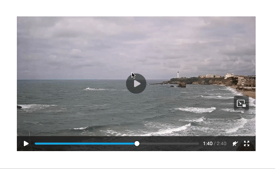

# Display video player for HLS stream

## Setup

> Relevant files are
> - [`config/importmap.rb`](./config/importmap.rb)
> - [`app/views/layouts/application.html.erb`](./app/views/layouts/application.html.erb)
> - [`app/controllers/pages_controller.rb`](./app/controllers/pages_controller.rb)
> - [`app/views/pages/home.html.erb`](./app/views/pages/home.html.erb)
> - [`app/javascript/controllers/video_player_controller.js`](./app/javascript/controllers/video_player_controller.js)
> - [`app/assets/stylesheets/components/_video_player.scss`](./app/assets/stylesheets/components/_video_player.scss)

### 1. Install Vidstack

1. Manually add the following line in your `config/importmap.rb` file:
    ```ruby
    pin "vidstack", to: "https://cdn.vidstack.io/player@1.11.21"
    ```

2. Add the following link tags in your `app/views/layouts/application.html.erb` file:
    ```html
    <link rel="stylesheet" href="https://cdn.vidstack.io/player/theme.css@1.11.21" />
    <link rel="stylesheet" href="https://cdn.vidstack.io/player/video.css@1.11.21" />
    ```

### 2. Display a player



1. Get an HLS stream URL:
    - In your browser, navigate to a website that livestreams something ([example](https://www.biarritz.fr/les-webcams/grande-plage-1)).
    - Open the developer tools and go to the **Network** tab.
    - Filter the requests to display only media requests.
    - Clear the tab and reload the page.
    - If the livestream does not autoplay, play it.
    - Find the first GET request that fetches a file with the `.m3u8` extension (e.g., `https://deliverys5.quanteec.com/contents/encodings/live/ffd2c10a-e812-4729-3930-3130-6d61-63-a799-247bcd11ebafdmaster.m3u8`).
    - Note the URL of this request.

2. Use the URL to configure the video player:
    ```ruby
    # app/controllers/pages_controller.rb
    # ...
        def home
            @url = "YOUR_URL"
        end
    # ...
    ```

3. Build the video player component:
    ```html
    <div class="video-player-container"
         data-controller="video-player"
         data-video-player-url-value="<%= @url %>"
    >
      <div data-video-player-target="player"></div>
    </div>
    ```

4. Connect and setup a Stimulus controller:
    ```bash
    rails g stimulus video-player
    ```

    Then in `javascript/controllers/video_player_controller.js`:
    ```javascript
    import { Controller } from "@hotwired/stimulus"
    import { VidstackPlayer } from 'vidstack';

    export default class extends Controller {
      static targets = ["player"]
      static values = { url: String }

      connect() {
        this.player = this.buildPlayer();
      }

      async buildPlayer() {
        this.player = await VidstackPlayer.create({
          target: this.playerTarget,
          title: 'Livefeed',
          src: this.urlValue,
          controls: true
        })
      }
    }
    ```

### 3. Customize the player (Optional)


1. Update the JavaScript:
    ```javascript
    import { Controller } from "@hotwired/stimulus"
    import { VidstackPlayer } from 'vidstack';

    export default class extends Controller {
      static targets = ["player"]
      static values = { url: String }

      connect() {
        this.player = this.buildPlayer();
      }

      async buildPlayer() {
        this.player = await VidstackPlayer.create({
          target: this.playerTarget,
          title: 'Livefeed',
          src: this.urlValue,
          controls: false,
          mute: true,
          aspectRatio: '16/9'
        })
        this.player.addEventListener('loaded-data', () => this.element.classList.remove('loading') );
        this.player.addEventListener('play',        () => this.element.classList.add('playing') );
        this.player.addEventListener('pause',       () => this.element.classList.remove('playing') );
      }

      playPause() {
        this.player.paused ? this.player.play() : this.player.pause();
      }
    }
    ```

2. Add the HTML overlay and classes:
    ```html
    <div class="video-player-container loading"
         data-controller="video-player"
         data-video-player-url-value="<%= @url %>"
    >
      <div data-video-player-target="player"></div>
      <div class="video-overlay video-poster">
        <%= image_tag 'waver_logo.png' %>
      </div>
      <div class="video-overlay video-controls"
           data-action="click->video-player#playPause"
      >
        <%= image_tag 'play_white.png', class: "video-icon video-icon-play" %>
        <%= image_tag 'pause_white.png', class: "video-icon video-icon-pause" %>
      </div>
    </div>
    ```

3. Add CSS in `app/assets/stylesheets/components/_video_player.scss`:
    > Don't forget to import the stylesheet in `app/assets/stylesheets/components/_index.scss`
    > ```scss
    > @import 'video_player';
    > ```
    ```scss
    $video-rounding: 1rem;

    .video-player-container {
      position: relative;
      aspect-ratio: 16 / 9;
      border-radius: $video-rounding;
      div[data-video-player-target="player"] {
        border-radius: $video-rounding;
        position: absolute;
        top: 0;
        bottom: 0;
        media-player {
          border-radius: $video-rounding;
        }
      }
      .video-overlay {
        position: absolute;
        top: 0;
        bottom: 0;
        left: 0;
        right: 0;
        width: 100%;
        height: 100%;
        display: flex;
        justify-content: center;
        align-items: center;
        transition: opacity 0.5s ease-in-out;
        opacity: 0;
      }
      .video-poster {
        pointer-events: none;
        img {
          max-width: 15rem;
          max-height: 15rem;
          object-fit: cover;
          border-radius: $video-rounding;
        }
      }
      .video-overlay {
        border-radius: $video-rounding;
        background-color: rgba(0, 0, 0, 0.2);
        color: white;
        font-size: 2rem;
        cursor: pointer;
        &:hover {
          opacity: 0.6 !important;
        }
        .video-icon {
          height: 50%;
          aspect-ratio: 1 / 1;
          max-height: 10rem;
        }
        .video-icon-play {
          display: block;
        }
        .video-icon-pause {
          display: none;
        }
      }

      &.playing {
        .video-overlay {
          opacity: 0;
          .video-icon-play {
            display: none;
          }
          .video-icon-pause {
            display: block;
          }
        }
      }

      &.loading {
        .video-poster {
          opacity: 1 !important;
        }
        .video-overlay {
          opacity: 0;
        }
      }
    }
    ```

